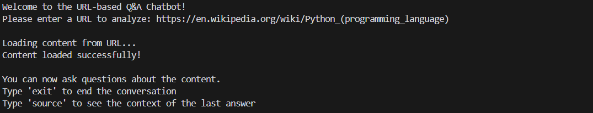
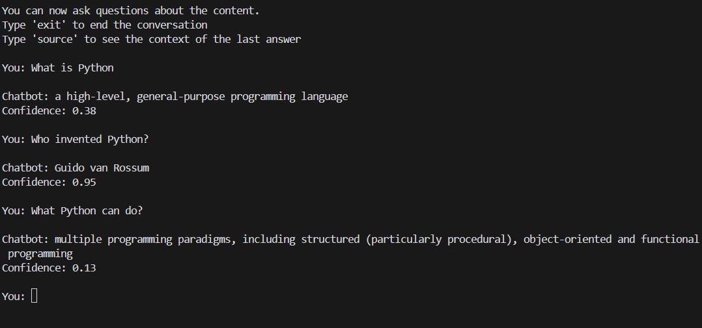

# URL-based Q&A Chatbot

A Python-based chatbot that can answer questions about content from any given URL. The chatbot uses natural language processing and machine learning to understand questions and provide relevant answers from the scraped content.


## Features

- URL content scraping and processing
- Natural language question answering
- Multi-language support (v2)
- Context-aware responses (v3)
- Source context viewing (v3)
- Confidence scoring (v3)

## Installation

1. Clone the repository:
    ```bash
    git clone https://github.com/JrCarol/QNA_chatbot.git
    cd QNA_chatbot
    ```

2. Create and activate a virtual environment:
    ```bash
    # Windows
    python -m venv .venv
    .venv\Scripts\activate

    # Unix/MacOS
    python -m venv .venv
    source .venv
    ```

3. Install dependencies:
    ```bash
    pip install -r src/requirements.txt
    ```

4. Download NLTK data for sentence tokenization:
    ```
    import nltk
    nltk.download('punkt')
    ```

## Usage
** Run the chatbot:
    ```
    python src/qna_bot.py
    ```

    ```bash
    For version 1
    python src/qna_bot.py

    For version 2
    python src/qna_bot_v2.py

    For version 3
    python src/qna_bot_v3.py
    ```

2. Enter a URL when prompted
3. Ask questions about the content
4. Special commands (v3):
   - Type 'source' to see the context of the last answer
   - Type 'exit' to end the conversation

## Example Interaction

Include URL


Ask Questions


## Acknowledgments

- HuggingFace Transformers library
- NLTK project
- Sentence-Transformers
- Beautiful Soup library
